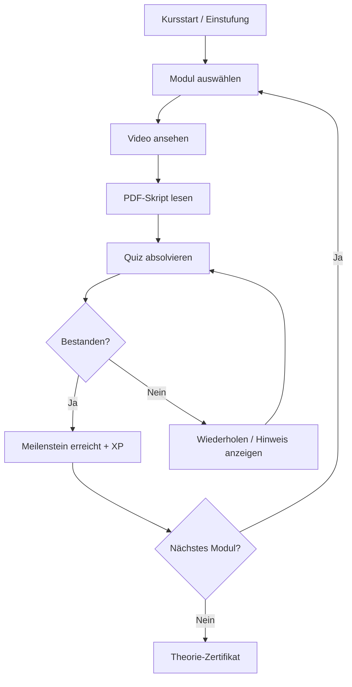
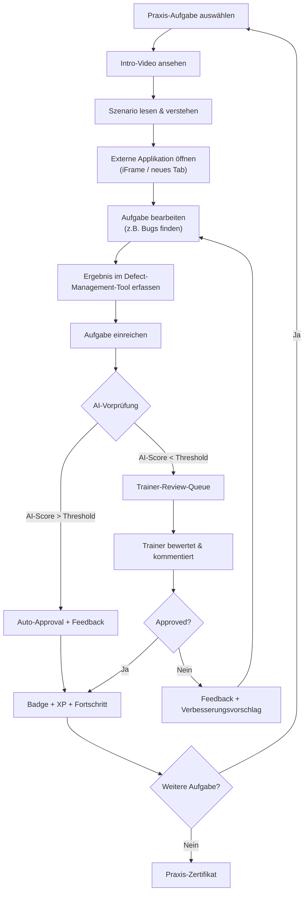
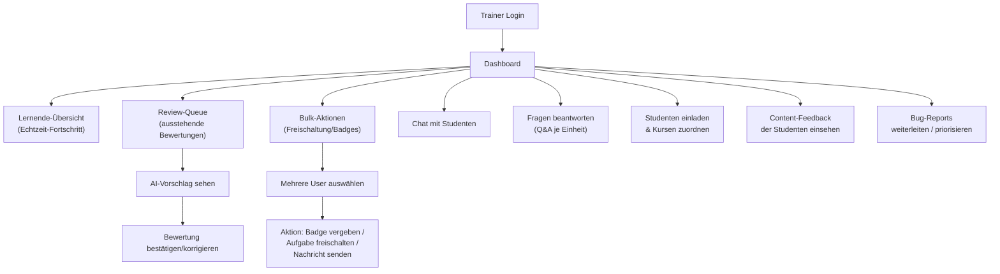
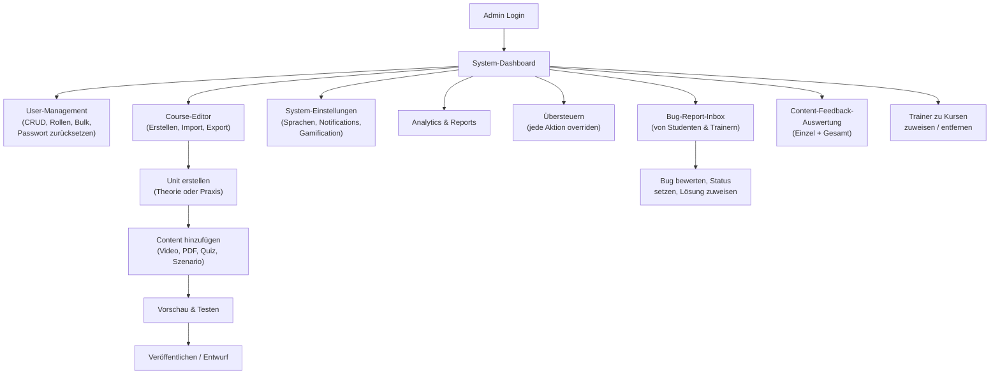
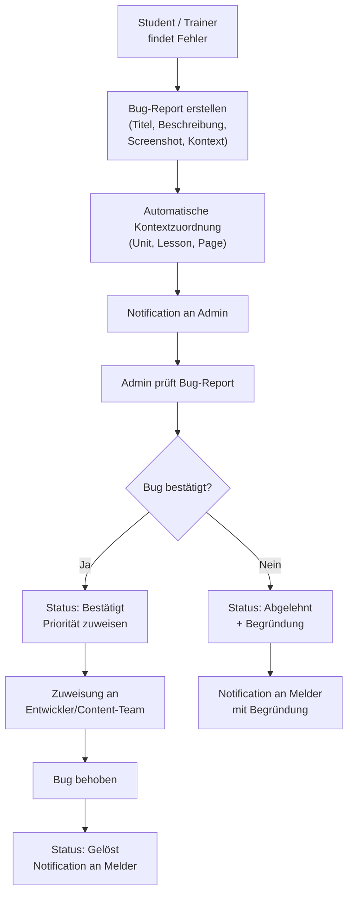
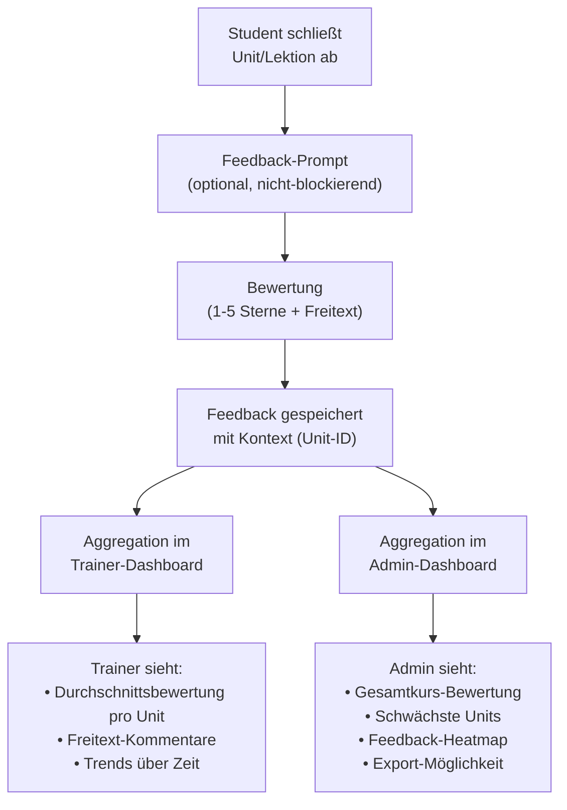

# 🎓 Research: State-of-the-Art Digitale Lernplattform mit Theorie- & Praxisteil

> **Erstellt:** 20. Juli 2026 | **Aktualisiert:** 20. Juli 2026  
> **Projekt:** DiTeLe 2.0 — Digitale Technische Lernplattform  
> **Ziel:** Identifikation, Vergleich und Empfehlung der bestmöglichen Lösung für eine Lernplattform mit 100–200 Units pro Kurs  
> **Kontext:** Aufbauend auf der bestehenden [DiTeLe Systemanalyse](file:///d:/Testprojekt/Marketingkampagne_Ultraboost/DiTeLe_Systemanalyse/00_UEBERSICHT.md)

---

## Inhaltsverzeichnis

1. [Anforderungskatalog](#1-anforderungskatalog)
2. [State-of-the-Art Analyse: Workflows & Komponenten](#2-state-of-the-art-analyse)
3. [Top 5 Lösungen im Detail](#3-top-5-lösungen)
4. [Vergleichsmatrix](#4-vergleichsmatrix)
5. [Kritische Analyse](#5-kritische-analyse)
6. [Empfehlung: Bestmögliche Lösung](#6-empfehlung)
7. [Technische Architektur-Referenz](#7-technische-architektur)
8. [Gamification-Konzept im Detail](#8-gamification-konzept)

---

## 1. Anforderungskatalog

Basierend auf den Vorgaben und State-of-the-Art Best Practices:

### 1.1 Kernfunktionen (aus Anforderungen)

| # | Anforderung | Priorität | Kategorie |
|---|-------------|-----------|-----------|
| R1 | **Theorie-Inhalte:** Videos, PDFs (Skripte), Quizzes, Meilensteine | KRITISCH | Content |
| R2 | **Praxisteil:** Szenario → Externer Link / iFrame (vergrößerbar, klickbar) → Defect-Management-Tool → Trainer-Validierung (AI-unterstützt) | KRITISCH | Practice |
| R3 | **Echtzeit-Fortschritt** + Chat (Trainer ↔ Student) | HOCH | Communication |
| R4 | **Kontextuelle Hinweise** (überall verfügbar) | HOCH | UX |
| R5 | **Aktive Notifications & Mail-Service** | HOCH | Notification |
| R6 | **Frage-Antwort-System** je Einheit | HOCH | Community |
| R7 | **Trainer Multi-Funktionen:** Bulk-Freischaltung, Badge-Vergabe, Mehrfach-User-Verwaltung, Studenten einladen & zu Kursen hinzufügen | HOCH | Admin |
| R8 | **Admin mit Vollzugriff** (Übersteuern aller Aktionen), User hinzufügen/löschen, Passwörter zurücksetzen, Trainer zu Kursen zuweisen/entfernen | KRITISCH | Admin |
| R9 | **Course-Editor** mit Import/Export | KRITISCH | Authoring |
| R10 | **Mehrsprachigkeit** (Kurse, Inhalte, UI) | HOCH | i18n |
| R11 | **Aufgaben mehrfach lösbar** (Wiederholung) | MITTEL | Learning |
| R12 | **Intro-Videos** für jede Praxisaufgabe | MITTEL | Content |
| R13 | **Fehlererstattung (Bug-Report):** Student oder Trainer können Fehler im System/Content melden → Admin erhält Übersicht | HOCH | Quality |
| R14 | **Content-Feedback-System:** Feedback zu einzelnen Inhalten & Gesamtkurs → Trainer und Admin erhalten Auswertung | HOCH | Quality |
| R15 | **User-Profile:** Jeder Nutzer hat ein eigenes Profil (Avatar, Bio, Fortschritt, Badges, Statistiken) | HOCH | User |
| R16 | **User-Management:** Admin erstellt/löscht User, setzt Passwörter zurück. Trainer kann Studenten einladen & Kursen zuordnen | HOCH | Admin |

### 1.2 Zusätzliche State-of-the-Art Anforderungen (aus Marktanalyse)

| # | Feature | Warum State-of-the-Art | Quelle |
|---|---------|----------------------|--------|
| S1 | **Gamification-Engine** (XP, Badges, Levels, Streaks, Leaderboard, Achievements) | Steigert Engagement um bis zu 40% | Docebo, TalentLMS, CYPHER |
| S2 | **AI-gestützte Bewertungen** & Empfehlungen | Personalisierung reduziert Abbruchrate um 25% | Sana Labs, CYPHER Agent |
| S3 | **Kompetenzbasierte Progression** (statt zeitbasiert) | Flexible Lerngeschwindigkeit als Standard 2026 | Pluralsight, Open edX |
| S4 | **Mobile-First / PWA** | 67% der Lernenden nutzen mobile Geräte | Branchenstandard |
| S5 | **Skill Assessment** (Einstufungstest vor Kursbeginn) | Personalisierte Startpunkte | Pluralsight |
| S6 | **Zertifizierungssystem** | Wertnachweis für Lernende | Udacity, Coursera |
| S7 | **Analytics & Reporting Dashboard** | Datengetriebene Entscheidungen für Trainer/Admin | Docebo, CYPHER |
| S8 | **SCORM/LTI-Kompatibilität** | Interoperabilität mit anderen Systemen | Moodle, Open edX |
| S9 | **Dark Mode & Accessibility (WCAG 2.1)** | Inklusivität und Usability | Branchenstandard |
| S10 | **Offline-Modus** (PWA-Cache) | Lernen ohne Internetverbindung | Mobile-Trend |
| S11 | **Aktivitäts-Log / Audit-Trail** | Nachvollziehbarkeit aller Aktionen im System | Enterprise-Standard |
| S12 | **Onboarding-Wizard** für neue Studenten | Reduziert Einstiegshürde, zeigt Plattform-Features | UX Best Practice |
| S13 | **Lesezeichen / Favoriten** | Student kann Inhalte für später markieren | Convenience |
| S14 | **Notiz-System** | Student kann private Notizen zu jeder Unit erstellen | Learning Retention |

---

## 2. State-of-the-Art Analyse: Workflows & Komponenten

### 2.1 Essenzielle Workflows einer modernen Lernplattform

#### Workflow A: Theorie-Lernpfad



#### Workflow B: Praxis-Lernpfad (DiTeLe-Kern)



#### Workflow C: Trainer-Verwaltung



#### Workflow D: Admin-Steuerung



#### Workflow E: Fehlererstattung (NEU)



#### Workflow F: Content-Feedback (NEU)



### 2.2 Technische Kernkomponenten

```
┌──────────────────────────────────────────────────────────────────────────────┐
│                    STATE-OF-THE-ART LERNPLATTFORM: KOMPONENTEN               │
│                                                                              │
│  ┌─── FRONTEND LAYER ────────────────────────────────────────────────────┐  │
│  │  Web App (SPA/SSR) │ PWA (Mobile) │ Admin Dashboard │ Course Editor   │  │
│  └────────────────────────────────────────────────────────────────────────┘  │
│                                                                              │
│  ┌─── API GATEWAY ──────────────────────────────────────────────────────┐  │
│  │  Auth │ Rate Limiting │ Routing │ API Versioning │ CORS              │  │
│  └────────────────────────────────────────────────────────────────────────┘  │
│                                                                              │
│  ┌─── CORE SERVICES ────────────────────────────────────────────────────┐  │
│  │                                                                        │  │
│  │  ┌────────────┐ ┌────────────┐ ┌─────────────┐ ┌──────────────────┐ │  │
│  │  │ Auth &     │ │ Learning   │ │ Content     │ │ Gamification     │ │  │
│  │  │ User Mgmt  │ │ Engine     │ │ Management  │ │ Engine           │ │  │
│  │  │            │ │            │ │             │ │                  │ │  │
│  │  │ • SSO/OAuth│ │ • Progress │ │ • CRUD      │ │ • XP/Level       │ │  │
│  │  │ • RBAC     │ │ • Assess   │ │ • Versions  │ │ • Badges         │ │  │
│  │  │ • JWT      │ │ • Paths    │ │ • Import/   │ │ • Streaks        │ │  │
│  │  │ • Profiles │ │ • Milest.  │ │   Export    │ │ • Leaderboard    │ │  │
│  │  │ • PW-Reset │ │ • AI Score │ │ • i18n      │ │ • Achievements   │ │  │
│  │  │ • Invite   │ │ • Repeat   │ │ • Feedback  │ │ • Belohnungen    │ │  │
│  │  └────────────┘ └────────────┘ └─────────────┘ └──────────────────┘ │  │
│  │                                                                        │  │
│  │  ┌────────────┐ ┌────────────┐ ┌─────────────┐ ┌──────────────────┐ │  │
│  │  │ Practice   │ │ Communic.  │ │ Notification│ │ Analytics &      │ │  │
│  │  │ Engine     │ │ Service    │ │ Service     │ │ Reporting        │ │  │
│  │  │            │ │            │ │             │ │                  │ │  │
│  │  │ • Scenario │ │ • Real-    │ │ • Push      │ │ • Dashboard      │ │  │
│  │  │ • iFrame   │ │   time Chat│ │ • E-Mail    │ │ • Progress       │ │  │
│  │  │ • Defect   │ │ • Q&A/Unit │ │ • In-App    │ │ • Completion     │ │  │
│  │  │   Mgmt     │ │ • Hints    │ │ • Scheduled │ │ • Engagement     │ │  │
│  │  │ • Trainer  │ │ • Forum    │ │ • Event-    │ │ • AI Insights    │ │  │
│  │  │   Approval │ │            │ │   triggered │ │ • Feedback-Agg.  │ │  │
│  │  └────────────┘ └────────────┘ └─────────────┘ └──────────────────┘ │  │
│  │                                                                        │  │
│  │  ┌────────────┐ ┌────────────┐                                       │  │
│  │  │ Bug-Report │ │ Feedback   │                                       │  │
│  │  │ Service    │ │ Service    │                                       │  │
│  │  │            │ │            │                                       │  │
│  │  │ • Erstellen│ │ • Unit-    │                                       │  │
│  │  │ • Kontext- │ │   Feedback │                                       │  │
│  │  │   zuordnung│ │ • Kurs-    │                                       │  │
│  │  │ • Status-  │ │   Feedback │                                       │  │
│  │  │   tracking │ │ • Aggregat.│                                       │  │
│  │  │ • Admin-   │ │ • Heatmap  │                                       │  │
│  │  │   Queue    │ │ • Export   │                                       │  │
│  │  └────────────┘ └────────────┘                                       │  │
│  └────────────────────────────────────────────────────────────────────────┘  │
│                                                                              │
│  ┌─── DATA LAYER ────────────────────────────────────────────────────────┐  │
│  │  PostgreSQL │ Redis (Cache/RT) │ S3/Storage │ Search Index            │  │
│  └────────────────────────────────────────────────────────────────────────┘  │
│                                                                              │
│  ┌─── INTEGRATION LAYER ─────────────────────────────────────────────────┐  │
│  │  External App (iFrame) │ Mail Provider │ AI/LLM API │ Webhooks        │  │
│  └────────────────────────────────────────────────────────────────────────┘  │
└──────────────────────────────────────────────────────────────────────────────┘
```

### 2.3 Technische Voraussetzungen

| Kategorie | Voraussetzung | Begründung |
|-----------|---------------|------------|
| **Infrastruktur** | Cloud-Hosting (Vercel, AWS, Railway) | Skalierbarkeit, Verfügbarkeit |
| **Datenbank** | PostgreSQL mit JSONB-Support | Flexible Schemas für Content-Typen |
| **Echtzeit** | WebSocket/SSE (Supabase Realtime, Socket.io) | Chat, Live-Fortschritt |
| **Auth** | OAuth 2.0 / JWT / SSO | Sichere Multi-Rolle-Authentifizierung |
| **Storage** | S3-kompatibel (Videos, PDFs) | Medien-Hosting mit CDN |
| **Mail** | Transactional Mail (SendGrid, Resend) | Notification-Service |
| **AI** | LLM-API (OpenAI, Claude, eigene Modelle) | Bewertungs-AI, Empfehlungen |
| **i18n** | ICU/i18next mit Database-backed Translations | Dynamische Mehrsprachigkeit |
| **Search** | Full-Text-Search (Meilisearch, Elasticsearch) | Content-Suche, Hints |
| **Monitoring** | Sentry, Plausible Analytics | Fehlererfassung, DSGVO-konform |
| **CI/CD** | GitHub Actions / Vercel | Automatisierte Deployments |
| **Security** | CSP-Headers, RLS, Rate Limiting, DSGVO | Datenschutz und Sicherheit |

---

## 3. Top 5 Lösungen im Detail

### 🥇 Lösung 1: Custom Build (Next.js + Supabase + AI)

> **Ansatz:** Maßgeschneiderte Plattform, komplett auf die DiTeLe-Anforderungen zugeschnitten

| Dimension | Detail |
|-----------|--------|
| **Tech-Stack** | Next.js (App Router), Supabase (Auth, DB, Realtime, Storage), shadcn/ui |
| **AI** | OpenAI/Claude API für Bewertungs-AI + Empfehlungen |
| **Hosting** | Vercel (Frontend) + Supabase Cloud (Backend) |
| **Kosten (Entwicklung)** | €60.000–€120.000 (6–9 Monate, 2–3 Entwickler) |
| **Kosten (Betrieb/Monat)** | €200–€800 (je nach Nutzerzahl) |
| **Time-to-Market** | 6–9 Monate |

**Stärken:**
- ✅ **100% Feature-Abdeckung** aller 16 Anforderungen
- ✅ Defect-Management-Tool nativ integriert (kein Plugin nötig)
- ✅ iFrame-Integration mit Resize, Fullscreen, postMessage-API
- ✅ Trainer-Validierung mit AI-Vorschlägen exakt nach Spezifikation
- ✅ Course-Editor mit Import/Export (JSON/SCORM) nativ
- ✅ Echtzeit-Chat über Supabase Realtime (zero extra cost)
- ✅ Volle Kontrolle über UX, Workflow und Skalierung
- ✅ DSGVO-konform (EU-Hosting möglich)
- ✅ Mehrsprachigkeit mit i18next + DB-backed Translations
- ✅ **Bug-Report-System** mit Kontextzuordnung und Admin-Queue
- ✅ **Content-Feedback** mit Aggregation für Trainer & Admin
- ✅ **User-Profile** mit Avatar, Bio, Statistiken, Badges
- ✅ **User-Management** (Admin: CRUD, PW-Reset; Trainer: Einladen)

**Schwächen:**
- ❌ Hohe initiale Entwicklungskosten
- ❌ Erfordert dediziertes Entwicklerteam
- ❌ Wartung und Updates in Eigenverantwortung
- ❌ Kein Marketplace/Community für Plugins

**Bewertung Anforderungserfüllung:**

| Anforderung | Erfüllung | Kommentar |
|-------------|-----------|-----------|
| R1 Theorie-Inhalte | ✅ 100% | Video-Player, PDF-Viewer, Quiz-Engine, Milestones nativ |
| R2 Praxisteil + Defect-Mgmt | ✅ 100% | Maßgeschneidert, iFrame mit CSP, Defect-Tracker als Modul |
| R3 Echtzeit + Chat | ✅ 100% | Supabase Realtime, WebSocket-basiert |
| R4 Hinweise überall | ✅ 100% | Kontextuelle Tooltip/Overlay-System |
| R5 Notifications + Mail | ✅ 100% | Event-driven mit Resend/SendGrid |
| R6 Q&A pro Einheit | ✅ 100% | Thread-basiertes Q&A je Lesson-ID |
| R7 Trainer Multi-Funktion | ✅ 100% | Bulk-Aktionen, Badge-Vergabe, Freischaltungen, Einladungen |
| R8 Admin Vollzugriff | ✅ 100% | Super-Admin mit Override, User-CRUD, PW-Reset, Kurs-Zuweisung |
| R9 Course-Editor | ✅ 100% | Drag & Drop, JSON-Import/Export |
| R10 Mehrsprachigkeit | ✅ 100% | i18n auf allen Ebenen (UI, Content, Kurse) |
| R11 Aufgaben wiederholbar | ✅ 100% | Attempts-Counter in user_progress |
| R12 Intro-Videos | ✅ 100% | Video-Upload + Player je Praxisaufgabe |
| R13 Fehlererstattung | ✅ 100% | Bug-Report mit Kontext, Screenshots, Admin-Queue |
| R14 Content-Feedback | ✅ 100% | Sterne + Freitext je Unit/Kurs, Aggregation für Trainer & Admin |
| R15 User-Profile | ✅ 100% | Editierbare Profile mit Avatar, Bio, Fortschritt, Badges |
| R16 User-Management | ✅ 100% | Admin: CRUD, PW-Reset, Kurs-/Trainer-Zuweisung; Trainer: Einladen |

---

### 🥈 Lösung 2: Moodle (Open Source) + Custom Plugins

> **Ansatz:** Etablierte Open-Source-Plattform mit maßgeschneiderten Erweiterungen

| Dimension | Detail |
|-----------|--------|
| **Tech-Stack** | PHP/Moodle Core, MySQL/PostgreSQL, 1900+ Plugins |
| **AI** | Plugin "AI Grade" + Custom OpenAI-Integration |
| **Hosting** | MoodleCloud oder Self-Hosted (AWS/Hetzner) |
| **Kosten (Entwicklung)** | €25.000–€55.000 (Plugin-Entwicklung, 3–6 Monate) |
| **Kosten (Betrieb/Monat)** | €100–€500 (Self-Hosted) oder €200–€1.000 (MoodleCloud) |
| **Time-to-Market** | 3–6 Monate |

**Stärken:**
- ✅ Etabliert (250+ Millionen Nutzer weltweit)
- ✅ Riesiges Plugin-Ökosystem (1.900+ Plugins)
- ✅ SCORM/LTI-Kompatibilität out-of-the-box
- ✅ Mehrsprachigkeit (100+ Sprachen)
- ✅ Course-Import/Export (.mbz, SCORM)
- ✅ Robustes Rollensystem (Admin, Teacher, Student, Custom)
- ✅ Quiz-Engine mit diversen Fragetypen
- ✅ Open Source → kein Vendor Lock-in
- ✅ User-Profile nativ vorhanden

**Schwächen:**
- ❌ **Veraltete UX** — PHP-basiertes Frontend fühlt sich "2010" an
- ❌ **Defect-Management-Tool** muss als Custom Plugin entwickelt werden
- ❌ **iFrame-Integration** funktioniert, aber ohne native Resize/Fullscreen-Features
- ❌ **Echtzeit-Chat** nur über externe Plugins (BigBlueButton, Matrix)
- ❌ **AI-Trainer-Validierung** erfordert aufwendige Custom-Entwicklung
- ❌ **Gamification** nur über Plugin (Level Up!, etc.) — nicht nativ integriert
- ❌ Skalierungsprobleme bei >10.000 gleichzeitigen Nutzern (monolithisch)
- ❌ Mobile-Experience suboptimal ohne Custom-Theme
- ❌ **Bug-Report-System** nicht für Content-Fehler ausgelegt
- ❌ **Content-Feedback** nur über Forum-Workaround möglich

**Bewertung Anforderungserfüllung:**

| Anforderung | Erfüllung | Kommentar |
|-------------|-----------|-----------|
| R1 Theorie-Inhalte | ✅ 95% | Nativ unterstützt, exzellent |
| R2 Praxisteil + Defect-Mgmt | ⚠️ 50% | iFrame ja, Defect-Tool als Custom Plugin |
| R3 Echtzeit + Chat | ⚠️ 60% | Nur über externe Plugins, nicht nativ |
| R4 Hinweise überall | ⚠️ 70% | Plugin-basiert, nicht kontextuell integriert |
| R5 Notifications + Mail | ✅ 85% | Grundfunktionen vorhanden, erweiterbar |
| R6 Q&A pro Einheit | ✅ 80% | Forum-Plugin je Kurs/Modul |
| R7 Trainer Multi-Funktion | ⚠️ 65% | Bulk-Aktionen eingeschränkt, Badge-Plugin nötig |
| R8 Admin Vollzugriff | ✅ 90% | Starkes Admin-Panel, PW-Reset vorhanden |
| R9 Course-Editor | ✅ 85% | Import/Export gut, Editor-UX veraltet |
| R10 Mehrsprachigkeit | ✅ 95% | Exzellent, 100+ Sprachen |
| R11 Aufgaben wiederholbar | ✅ 90% | Nativ mit Attempt-Limit-Konfiguration |
| R12 Intro-Videos | ✅ 85% | Video-Upload möglich, kein dedizierter "Intro"-Slot |
| R13 Fehlererstattung | ⚠️ 40% | Kein natives Bug-Report-System für Content-Fehler |
| R14 Content-Feedback | ⚠️ 45% | Feedback nur über Forum oder Custom-Plugin |
| R15 User-Profile | ✅ 80% | Profil vorhanden, aber wenig customizable |
| R16 User-Management | ✅ 85% | User-CRUD, Bulk-Upload, PW-Reset nativ |

---

### 🥉 Lösung 3: Open edX + Custom XBlocks

> **Ansatz:** Enterprise-fähige Open-Source-MOOC-Plattform mit XBlock-Erweiterungen

| Dimension | Detail |
|-----------|--------|
| **Tech-Stack** | Python/Django (Backend), React (Frontend), Docker/K8s |
| **AI** | ORA AI (Open Response Assessments) + Custom Integrations |
| **Hosting** | Self-Hosted (AWS/GCP) oder Managed (Tutor, Appsembler) |
| **Kosten (Entwicklung)** | €35.000–€70.000 (XBlock-Entwicklung, 4–7 Monate) |
| **Kosten (Betrieb/Monat)** | €300–€1.200 (Self-Hosted) oder €500–€2.000 (Managed) |
| **Time-to-Market** | 4–7 Monate |

**Stärken:**
- ✅ Skalierbar (Microservices-Architektur, genutzt von edX/Harvard/MIT)
- ✅ XBlock-System für benutzerdefinierte Interaktionstypen
- ✅ Starke Assessment-Engine (ORA = Open Response Assessment)
- ✅ LTI-Kompatibilität (externe Tools einbinden)
- ✅ Fortschrittstracking mit detaillierten Analytics
- ✅ Kursimport/-Export (XML/JSON)
- ✅ Rollenbasierte Zugriffskontrolle (Staff, Instructor, Student)
- ✅ AI-Grading über ORA AI-Erweiterungen

**Schwächen:**
- ❌ **Sehr hohe Komplexität** — Einrichtung und Wartung erfordern DevOps-Expertise
- ❌ **Defect-Management** muss als Custom XBlock entwickelt werden
- ❌ **Echtzeit-Chat** nicht nativ (externe Integration nötig)
- ❌ **Gamification** nur rudimentär (kein natives Badge/XP/Leaderboard)
- ❌ **Trainer-Bulk-Aktionen** eingeschränkt
- ❌ **Mehrsprachigkeit für Content** komplex (UI-i18n ja, Content-i18n manuell)
- ❌ **Steile Lernkurve** für Administratoren und Content-Ersteller
- ❌ Hohe Hosting-Kosten (Docker/K8s-Cluster)
- ❌ **Kein Content-Feedback-System** nativ
- ❌ **Bug-Reporting** nur über externe Tracker

**Bewertung Anforderungserfüllung:**

| Anforderung | Erfüllung | Kommentar |
|-------------|-----------|-----------|
| R1 Theorie-Inhalte | ✅ 90% | Video, Text, Quiz nativ, PDF einbettbar |
| R2 Praxisteil + Defect-Mgmt | ⚠️ 55% | XBlock für iFrame, Defect-Tool als Custom XBlock |
| R3 Echtzeit + Chat | ❌ 35% | Nicht nativ, Forum ja, Chat nein |
| R4 Hinweise überall | ⚠️ 60% | Über Annotations/Notes, nicht kontextuell |
| R5 Notifications + Mail | ⚠️ 70% | Basis-Notifications, Mail konfigurierbar |
| R6 Q&A pro Einheit | ✅ 80% | Discussion-Forum je Kursabschnitt |
| R7 Trainer Multi-Funktion | ⚠️ 55% | Rollen ja, Bulk-Aktionen eingeschränkt |
| R8 Admin Vollzugriff | ✅ 80% | Admin-Dashboard, aber Override-UX umständlich |
| R9 Course-Editor | ✅ 80% | Studio-Editor, Import/Export vorhanden |
| R10 Mehrsprachigkeit | ⚠️ 65% | UI-i18n ja, Content-i18n manuell |
| R11 Aufgaben wiederholbar | ✅ 85% | Konfigurierbare Attempt-Limits |
| R12 Intro-Videos | ✅ 80% | Video-Sequenz vor Units möglich |
| R13 Fehlererstattung | ❌ 25% | Kein internes Bug-Report-System |
| R14 Content-Feedback | ❌ 30% | Nur über Diskussion, keine Aggregation |
| R15 User-Profile | ⚠️ 60% | Basis-Profil, wenig Gamification-Integration |
| R16 User-Management | ✅ 75% | User-Verwaltung vorhanden, Einladungen umständlich |

---

### 4️⃣ Lösung 4: CYPHER Learning (SaaS)

> **Ansatz:** AI-native Enterprise-LMS mit umfassender Gamification und Multilingual-Support

| Dimension | Detail |
|-----------|--------|
| **Tech-Stack** | Proprietäre SaaS-Plattform (Cloud-hosted) |
| **AI** | CYPHER Agent (Practice, Assess, Recommend) nativ integriert |
| **Hosting** | SaaS (vom Anbieter verwaltet) |
| **Kosten (Entwicklung)** | €5.000–€15.000 (Konfiguration und Anpassung) |
| **Kosten (Betrieb/Monat)** | €500–€3.000+ (Enterprise-Pricing auf Anfrage) |
| **Time-to-Market** | 1–3 Monate |

**Stärken:**
- ✅ **AI-native** — CYPHER Agent mit Practice & Assess Tools
- ✅ **Beste Mehrsprachigkeit** am Markt (50+ Sprachen, Universal Translator)
- ✅ **Umfassende Gamification** (Badges, Levels, Leaderboards, Automations)
- ✅ **Schnellste Time-to-Market** (SaaS → sofort nutzbar)
- ✅ Rollenbasierte Verwaltung mit Bulk-Aktionen
- ✅ Integrierte Notifications (Multi-Channel)
- ✅ Kursimport/Export
- ✅ Mobile App
- ✅ User-Profile mit Social Features

**Schwächen:**
- ❌ **Kein natives Defect-Management-Tool** — nur über externe Integration
- ❌ **iFrame-Embedding** eingeschränkt (SaaS-Limitierungen)
- ❌ **Kein Echtzeit-Chat** (Trainer ↔ Student) nativ — Messaging ja, Chat nein
- ❌ **Vendor Lock-in** — Daten gehören dem SaaS-Anbieter
- ❌ **Keine volle Kontrolle** über UX und Workflows
- ❌ **Keine DSGVO-Garantie** — Datenhosting ggf. außerhalb EU
- ❌ **Hohe laufende Kosten** bei Enterprise-Pricing
- ❌ **Q&A pro Einheit** nur über Diskussionsforum (nicht dediziertes Q&A)
- ❌ **Custom Trainer-AI-Validierung** nicht konfigurierbar nach eigenen Regeln
- ❌ **Bug-Report-System** nicht für Content-Fehler konfigurierbar
- ❌ **Content-Feedback-Aggregation** eingeschränkt

**Bewertung Anforderungserfüllung:**

| Anforderung | Erfüllung | Kommentar |
|-------------|-----------|-----------|
| R1 Theorie-Inhalte | ✅ 95% | Video, PDF, Quiz, Milestones nativ |
| R2 Praxisteil + Defect-Mgmt | ❌ 30% | Praxis-Simulationen ja, Defect-Tool und eigenes iFrame nein |
| R3 Echtzeit + Chat | ⚠️ 55% | Messaging ja, Echtzeit-Chat nein |
| R4 Hinweise überall | ✅ 80% | Tooltips und Help-Center vorhanden |
| R5 Notifications + Mail | ✅ 90% | Multi-Channel, automatisiert |
| R6 Q&A pro Einheit | ⚠️ 70% | Forum-basiert, nicht dediziert pro Unit |
| R7 Trainer Multi-Funktion | ✅ 85% | Bulk-Aktionen, Badge-Vergabe |
| R8 Admin Vollzugriff | ✅ 85% | Starkes Admin-Panel, aber SaaS-Limitierungen |
| R9 Course-Editor | ✅ 90% | AI-unterstützter Editor, Import/Export |
| R10 Mehrsprachigkeit | ✅ 100% | Benchmark am Markt, 50+ Sprachen |
| R11 Aufgaben wiederholbar | ✅ 85% | Konfigurierbar |
| R12 Intro-Videos | ✅ 85% | Video-Einbettung möglich |
| R13 Fehlererstattung | ⚠️ 45% | Support-Tickets ja, aber nicht Content-spezifisch |
| R14 Content-Feedback | ⚠️ 60% | Feedback-Formulare vorhanden, Aggregation begrenzt |
| R15 User-Profile | ✅ 85% | Profile mit Social Features |
| R16 User-Management | ✅ 85% | User-Verwaltung, Einladungen, Bulk |

---

### 5️⃣ Lösung 5: Hybrid-Ansatz (Moodle/Open edX Backend + Custom Next.js Frontend)

> **Ansatz:** Kombination aus bewährtem LMS-Backend mit modernem, maßgeschneidertem Frontend

| Dimension | Detail |
|-----------|--------|
| **Tech-Stack** | Moodle/Open edX (Headless Backend) + Next.js (Custom Frontend) + Supabase (Echtzeit/Chat) |
| **AI** | Custom AI-Layer über LLM-APIs |
| **Hosting** | Moodle: Self-Hosted, Frontend: Vercel, Chat: Supabase |
| **Kosten (Entwicklung)** | €45.000–€90.000 (5–8 Monate) |
| **Kosten (Betrieb/Monat)** | €300–€1.000 |
| **Time-to-Market** | 5–8 Monate |

**Stärken:**
- ✅ **Best of Both Worlds** — bewährtes LMS + moderne UX
- ✅ Nutzt Moodle/Open edX für bewährtes User-Management, Kursstruktur, SCORM
- ✅ Custom Frontend erlaubt volle UX-Kontrolle
- ✅ Echtzeit-Features über Supabase
- ✅ Defect-Management und iFrame als Custom Components
- ✅ Community-Support des LMS + eigene Frontend-Flexibilität

**Schwächen:**
- ❌ **Hohe Komplexität** — zwei Systeme müssen synchronisiert werden
- ❌ **Doppelte Wartung** (LMS-Updates + Frontend-Updates)
- ❌ **API-Limitierungen** von Moodle/Open edX als Headless Backend
- ❌ **Dateninkonsistenz-Risiko** zwischen LMS und Custom-Layer
- ❌ **Debugging** über zwei Systeme hinweg aufwendig
- ❌ Höhere DevOps-Anforderungen
- ❌ **Bug-Report und Feedback** müssen im Custom-Layer gebaut werden (LMS hat keine passende API dafür)

**Bewertung Anforderungserfüllung:**

| Anforderung | Erfüllung | Kommentar |
|-------------|-----------|-----------|
| R1 Theorie-Inhalte | ✅ 95% | LMS-Backend + Custom-Frontend-Rendering |
| R2 Praxisteil + Defect-Mgmt | ⚠️ 75% | Custom Components im Frontend, LMS-Backend für Daten |
| R3 Echtzeit + Chat | ✅ 85% | Supabase Realtime-Layer |
| R4 Hinweise überall | ✅ 85% | Custom Frontend-Tooltips |
| R5 Notifications + Mail | ✅ 85% | LMS-Notifications + Custom-Layer |
| R6 Q&A pro Einheit | ✅ 80% | LMS-Forum + Custom-UI |
| R7 Trainer Multi-Funktion | ⚠️ 70% | LMS-Admin + Custom Bulk-UI |
| R8 Admin Vollzugriff | ✅ 85% | LMS-Admin + Custom Override-Layer |
| R9 Course-Editor | ✅ 85% | LMS-Editor + Custom-Frontend-Preview |
| R10 Mehrsprachigkeit | ✅ 90% | LMS-i18n + Frontend-i18n |
| R11 Aufgaben wiederholbar | ✅ 90% | LMS-Attempts-System |
| R12 Intro-Videos | ✅ 85% | Custom Video-Component |
| R13 Fehlererstattung | ⚠️ 65% | Custom-Build im Frontend nötig |
| R14 Content-Feedback | ⚠️ 65% | Custom-Build im Frontend nötig |
| R15 User-Profile | ✅ 80% | LMS-Profile + Custom-Frontend |
| R16 User-Management | ✅ 85% | LMS-User-Admin + Custom-Invite-Flow |

---

## 4. Vergleichsmatrix

### 4.1 Feature-Vergleich (alle 16 Anforderungen + State-of-the-Art)

| Anforderung | Custom Build | Moodle | Open edX | CYPHER | Hybrid |
|-------------|:----------:|:------:|:--------:|:------:|:------:|
| **R1** Theorie-Inhalte | ✅ 100% | ✅ 95% | ✅ 90% | ✅ 95% | ✅ 95% |
| **R2** Praxis + Defect-Mgmt | ✅ 100% | ⚠️ 50% | ⚠️ 55% | ❌ 30% | ⚠️ 75% |
| **R3** Echtzeit + Chat | ✅ 100% | ⚠️ 60% | ❌ 35% | ⚠️ 55% | ✅ 85% |
| **R4** Hinweise überall | ✅ 100% | ⚠️ 70% | ⚠️ 60% | ✅ 80% | ✅ 85% |
| **R5** Notifications + Mail | ✅ 100% | ✅ 85% | ⚠️ 70% | ✅ 90% | ✅ 85% |
| **R6** Q&A pro Einheit | ✅ 100% | ✅ 80% | ✅ 80% | ⚠️ 70% | ✅ 80% |
| **R7** Trainer Multi-Funktion | ✅ 100% | ⚠️ 65% | ⚠️ 55% | ✅ 85% | ⚠️ 70% |
| **R8** Admin Vollzugriff + User-Mgmt | ✅ 100% | ✅ 90% | ✅ 80% | ✅ 85% | ✅ 85% |
| **R9** Course-Editor Import/Export | ✅ 100% | ✅ 85% | ✅ 80% | ✅ 90% | ✅ 85% |
| **R10** Mehrsprachigkeit | ✅ 100% | ✅ 95% | ⚠️ 65% | ✅ 100% | ✅ 90% |
| **R11** Aufgaben wiederholbar | ✅ 100% | ✅ 90% | ✅ 85% | ✅ 85% | ✅ 90% |
| **R12** Intro-Videos | ✅ 100% | ✅ 85% | ✅ 80% | ✅ 85% | ✅ 85% |
| **R13** Fehlererstattung | ✅ 100% | ⚠️ 40% | ❌ 25% | ⚠️ 45% | ⚠️ 65% |
| **R14** Content-Feedback | ✅ 100% | ⚠️ 45% | ❌ 30% | ⚠️ 60% | ⚠️ 65% |
| **R15** User-Profile | ✅ 100% | ✅ 80% | ⚠️ 60% | ✅ 85% | ✅ 80% |
| **R16** User-Management | ✅ 100% | ✅ 85% | ✅ 75% | ✅ 85% | ✅ 85% |
| | | | | | |
| **S1** Gamification | ✅ 100% | ⚠️ 60% | ❌ 30% | ✅ 95% | ⚠️ 65% |
| **S2** AI-Bewertungen | ✅ 100% | ⚠️ 50% | ⚠️ 55% | ✅ 90% | ✅ 80% |
| **S3** Kompetenzbasiert | ✅ 100% | ⚠️ 70% | ✅ 80% | ✅ 85% | ⚠️ 75% |
| **S4** Mobile/PWA | ✅ 95% | ⚠️ 55% | ⚠️ 50% | ✅ 90% | ✅ 85% |
| | | | | | |
| **Gesamtscore** | **100%** | **71%** | **59%** | **75%** | **80%** |

### 4.2 Kosten- & Risikovergleich

| Dimension | Custom Build | Moodle | Open edX | CYPHER | Hybrid |
|-----------|:----------:|:------:|:--------:|:------:|:------:|
| Initiale Kosten | 🔴 €60–120k | 🟢 €25–55k | 🟡 €35–70k | 🟢 €5–15k | 🟡 €45–90k |
| Monatliche Kosten | 🟢 €200–800 | 🟢 €100–500 | 🟡 €300–1.200 | 🔴 €500–3.000 | 🟡 €300–1.000 |
| Time-to-Market | 🔴 6–9 Mon. | 🟡 3–6 Mon. | 🔴 4–7 Mon. | 🟢 1–3 Mon. | 🟡 5–8 Mon. |
| Vendor Lock-in | 🟢 Keines | 🟢 Keines | 🟢 Keines | 🔴 Hoch | 🟡 Teilweise |
| Wartungsaufwand | 🟡 Mittel | 🟡 Mittel | 🔴 Hoch | 🟢 Gering | 🔴 Hoch |
| Skalierbarkeit | 🟢 Hoch | 🟡 Mittel | 🟢 Hoch | 🟢 Hoch | 🟡 Mittel |
| DSGVO-Konformität | 🟢 Voll | 🟢 Voll | 🟢 Voll | 🔴 Unsicher | 🟢 Voll |
| UX-Qualität | 🟢 State-of-Art | 🔴 Veraltet | 🟡 Funktional | 🟢 Modern | 🟢 Modern |

### 4.3 Gesamtbewertung (Scoring 1–10)

| Kriterium (Gewichtung) | Custom Build | Moodle | Open edX | CYPHER | Hybrid |
|------------------------|:----------:|:------:|:--------:|:------:|:------:|
| Feature-Abdeckung (25%) | 10 | 7 | 6 | 7 | 8 |
| UX/Design (15%) | 10 | 4 | 5 | 8 | 9 |
| Praxis-/Defect-Features (15%) | 10 | 5 | 5 | 3 | 7 |
| Bug-Report/Feedback/Profile (10%) | 10 | 5 | 3 | 6 | 7 |
| Gamification (10%) | 10 | 6 | 3 | 9 | 6 |
| Kosten (TCO 3 Jahre) (10%) | 6 | 8 | 6 | 5 | 6 |
| Time-to-Market (5%) | 4 | 7 | 5 | 10 | 5 |
| Skalierbarkeit/Zukunft (10%) | 9 | 6 | 8 | 7 | 6 |
| | | | | | |
| **Gewichteter Score** | **9.0** | **5.9** | **5.2** | **6.5** | **7.1** |

---

## 5. Kritische Analyse

### 5.1 Warum Fertiglösungen für DiTeLe nicht ausreichen

> [!IMPORTANT]
> Die Kombination aus **Defect-Management-Tool**, **iFrame-Integration mit Testwebseite**, **Trainer-Validierung mit AI-Vorschlägen**, **Content-Feedback-System**, **Bug-Report-Feature** und **szenariobasiertem Praxisteil** ist ein **einzigartiges Feature-Set**, das keine bestehende Plattform nativ abdeckt.

**Kernproblem bei SaaS-Lösungen (CYPHER, Docebo, TalentLMS):**
1. Das Defect-Management-Tool ist DiTeLes USP — SaaS-Plattformen haben dies nicht
2. Die iFrame-Integration zur Testwebseite mit Resize/Fullscreen erfordert Custom-Code
3. Die Trainer-AI-Validierung mit eigenen Bewertungsregeln ist in keiner SaaS konfigurierbar
4. 100–200 Units pro Kurs sprengen das Konfigurationsmodell vieler SaaS-Lösungen
5. Content-Feedback-Aggregation mit Heatmap und Export ist nicht vorgesehen
6. Bug-Report mit automatischer Kontextzuordnung (Unit, Lesson, Page) existiert nicht

**Kernproblem bei Open-Source-Lösungen (Moodle, Open edX):**
1. Die UX beider Plattformen ist nicht mehr zeitgemäß für ein Premiumprodukt
2. Plugin/XBlock-Entwicklung für Defect-Management ist fast so aufwendig wie ein Custom Build
3. Echtzeit-Chat-Integration ist in beiden Plattformen ein Schwachpunkt
4. Gamification in Moodle ist Plugin-basiert und in Open edX praktisch nicht vorhanden
5. Weder Moodle noch Open edX haben ein Content-Feedback-System mit Trainer/Admin-Auswertung
6. Bug-Reporting für Content-Fehler muss komplett custom entwickelt werden

### 5.2 Risiko-Analyse je Lösung

| Lösung | Hauptrisiko | Eintrittswahrscheinlichkeit | Impact | Mitigation |
|--------|-------------|---------------------------|--------|------------|
| **Custom Build** | Budgetüberschreitung | MITTEL | HOCH | Agiles Vorgehen, MVP-Ansatz |
| **Moodle** | UX-Ablehnung durch Nutzer | HOCH | HOCH | Custom Theme (hoher Aufwand) |
| **Open edX** | DevOps-Überlastung | HOCH | HOCH | Managed Hosting (teuer) |
| **CYPHER** | Feature-Gap bei Praxis | SEHR HOCH | KRITISCH | Keine sinnvolle Mitigation |
| **Hybrid** | System-Inkonsistenz | MITTEL | HOCH | Klare API-Contracts |

### 5.3 3-Jahres Total Cost of Ownership (TCO)

```
Annahme: 500 aktive Nutzer, 2 Trainer, 1 Admin

Custom Build:   €80.000 (Dev) + €600/Mo × 36 = €101.600    → TCO: ~€102.000
Moodle:         €45.000 (Dev) + €300/Mo × 36 = €55.800     → TCO: ~€56.000
Open edX:       €55.000 (Dev) + €750/Mo × 36 = €82.000     → TCO: ~€82.000
CYPHER:         €10.000 (Setup) + €1.500/Mo × 36 = €64.000  → TCO: ~€64.000
Hybrid:         €70.000 (Dev) + €650/Mo × 36 = €93.400     → TCO: ~€93.000

⚠️ Nicht eingerechnet: Personalkosten für Wartung, Content-Erstellung,
   Opportunitätskosten durch fehlende Features bei SaaS/Open-Source.
   
⚠️ Hinweis: Die höheren Dev-Kosten beim Custom Build reflektieren
   die zusätzlichen Features R13-R16 + erweiterte Gamification.
```

---

## 6. Empfehlung: Bestmögliche Lösung

> [!CAUTION]
> **Empfehlung: Lösung 1 — Custom Build (Next.js + Supabase + AI)**

### Warum Custom Build die beste Wahl für DiTeLe ist:

#### 1. Einziges System mit 100% Feature-Abdeckung

Keine andere Lösung deckt alle 16 Anforderungen ab. Insbesondere die Kombination aus:
- ✅ Integriertes Defect-Management-Tool (DiTeLes USP)
- ✅ iFrame mit Resize/Fullscreen/postMessage
- ✅ Trainer-Validierung mit konfigurierbarer AI
- ✅ Echtzeit-Chat über Supabase Realtime
- ✅ Bug-Report-System mit automatischer Kontextzuordnung
- ✅ Content-Feedback mit Aggregation und Heatmap
- ✅ Vollständige User-Profile mit Gamification
- ✅ Flexibles User-Management (Admin + Trainer)

#### 2. DiTeLes USP erfordert Custom-Code

Das Defect-Management-Tool, die Testwebseite-Integration und die AI-gestützte Bewertung sind **Alleinstellungsmerkmale**, die in keiner bestehenden Plattform nativ verfügbar sind. Bei Moodle/Open edX müsste man diese als Custom Plugins bauen — fast gleicher Aufwand, aber mit einem veralteten Tech-Stack.

#### 3. Wirtschaftlichkeit über 3 Jahre

| Kostenvergleich (3 Jahre) | Summe | Pro Nutzer/Monat |
|---------------------------|-------|-----------------|
| Custom Build | ~€102.000 | ~€5,67 |
| Moodle (günstigster) | ~€56.000 | ~€3,11 |
| CYPHER (SaaS) | ~€64.000 | ~€3,56 |

Der Mehrpreis von ~€46.000 gegenüber Moodle erkauft eine **vollständige Feature-Abdeckung aller 16 Anforderungen, moderne UX, volle Gamification, Bug-Reports, Content-Feedback und keine Vendor-Einschränkungen**.

#### 4. Zukunftssicherheit

- Next.js + Supabase = aktiver Community-Support und Long-Term-Support
- AI-Features (Bewertungen, Empfehlungen) lassen sich iterativ ausbauen
- Kein Vendor Lock-in, kein Plugin-Dependency-Hell
- PWA-fähig = Mobile-First ohne separate App

### Empfohlener Tech-Stack (Detail)

| Komponente | Technologie | Begründung |
|------------|-------------|------------|
| **Frontend** | Next.js 15 (App Router) + shadcn/ui | SSR, ISR, moderne Component-Library |
| **Backend** | Supabase (PostgreSQL + Auth + Realtime + Storage) | All-in-One, serverless, DSGVO-möglich |
| **AI** | OpenAI API (GPT-4o) / Claude API | Bewertungs-AI, Content-Empfehlungen |
| **Mail** | Resend (EU-hosted) | Transactional E-Mails, DSGVO |
| **i18n** | next-intl + DB-backed Translations | UI + Content-Mehrsprachigkeit |
| **Video** | Mux / Cloudflare Stream | Video-Hosting, HLS-Streaming |
| **Search** | Meilisearch | Leichtgewichtig, schnell, Self-Hosted |
| **Hosting** | Vercel (Frontend) + Supabase Cloud EU | Performance, EU-Hosting |
| **Monitoring** | Sentry + Plausible Analytics | Fehler-Tracking, DSGVO-konform |
| **CI/CD** | GitHub Actions | Automatisiertes Testing & Deployment |

### Empfohlene Roadmap

```
Phase 0: Foundation (2 Wochen)
├── Supabase-Projekt aufsetzen (EU-Region)
├── Next.js-Projekt initialisieren
├── Auth-System (Rollen: Admin, Trainer, Student)
├── Design-System (shadcn/ui + Custom Theme)
├── Database-Schema (Kern-Entitäten)
└── User-Profile-Grundstruktur

Phase 1: Core Learning (6 Wochen)
├── Kursstruktur (Kurse → Module → Units → Lektionen)
├── Theorie-Engine (Video, PDF, Quiz, Meilensteine)
├── Fortschrittstracking (kompetenzbasiert)
├── Course-Editor (Admin) mit Drag & Drop
├── Import/Export (JSON-Format)
└── User-Profile (Avatar, Bio, Statistiken)

Phase 2: Praxis-Engine (6 Wochen)
├── Szenario-System mit Intro-Videos
├── iFrame-Integration (Resize, Fullscreen, CSP)
├── Defect-Management-Modul (Tickets erstellen, Status, Severity)
├── Trainer-Review-Queue mit AI-Vorschlägen
└── Aufgaben-Wiederholung (Attempts)

Phase 3: Communication & Gamification (5 Wochen)
├── Echtzeit-Chat (Supabase Realtime)
├── Q&A-System pro Einheit
├── Notification-Service (Push, E-Mail, In-App)
├── Gamification-Engine (XP, Badges, Levels, Streaks, Leaderboard)
├── Kontextuelle Hinweise (Tooltip/Overlay-System)
├── Fortschritts-Dashboard für Studenten
└── Achievement-Animationen und Celebration-Screens

Phase 4: Admin, Trainer & Quality Tools (4 Wochen)
├── Admin-Dashboard mit Override-Funktionen
├── Admin User-Management (CRUD, PW-Reset, Rollenverwaltung)
├── Trainer-Dashboard (Echtzeit-Fortschritt, Review-Queue)
├── Trainer: Studenten einladen & Kursen zuordnen
├── Admin: Trainer zu Kursen zuweisen/entfernen
├── Bulk-Aktionen (Badge-Vergabe, Freischaltungen, Messaging)
├── Bug-Report-System (Erstellen, Kontextzuordnung, Admin-Queue)
├── Content-Feedback-System (Sterne + Freitext, Aggregation)
├── Mehrsprachigkeit (UI + Content)
└── Analytics & Reporting

Phase 5: Polish & Launch (3 Wochen)
├── Performance-Optimierung
├── Security Audit (CSP, RLS, Rate Limiting)
├── DSGVO-Compliance
├── Onboarding-Wizard für neue Studenten
├── Betatest mit 10–20 Nutzern
├── Dokumentation
└── Go-Live

─────────────────────────────────────
Gesamt: ~26 Wochen (~6,5 Monate)
Team: 2 Fullstack-Entwickler + 1 Designer (Teilzeit)
```

---

## 7. Technische Architektur-Referenz

### 7.1 System-Architektur (Custom Build)

```
┌──────────────────────────────────────────────────────────────────────────┐
│                        DiTeLe 2.0 — Custom Build                         │
│                                                                          │
│  ┌─── VERCEL ────────────────────────────────────────────────────────┐  │
│  │  Next.js 15 (App Router)                                          │  │
│  │  ├── /app/(auth)/         → Login, Register, SSO, Invite          │  │
│  │  ├── /app/(student)/      → Kurs, Praxis, Chat, Profil, Feedback │  │
│  │  ├── /app/(trainer)/      → Review, Dashboard, Bulk, Einladen    │  │
│  │  ├── /app/(admin)/        → Vollzugriff, Editor, User-Mgmt, Bugs│  │
│  │  └── /app/api/            → Server Actions, Webhooks, AI         │  │
│  └───────────────────────────────────────────────────────────────────┘  │
│                              │                                          │
│  ┌─── SUPABASE (EU) ────────▼────────────────────────────────────────┐  │
│  │                                                                    │  │
│  │  ┌──────────┐ ┌──────────┐ ┌──────────┐ ┌──────────────────────┐ │  │
│  │  │ Auth     │ │ Database │ │ Realtime │ │ Storage              │ │  │
│  │  │          │ │(Postgres)│ │(WebSocket│ │                      │ │  │
│  │  │ • JWT    │ │          │ │          │ │ • Videos (HLS)       │ │  │
│  │  │ • OAuth  │ │ • Kurse  │ │ • Chat   │ │ • PDFs              │ │  │
│  │  │ • MFA    │ │ • Users  │ │ • Progress│ │ • Bilder            │ │  │
│  │  │ • RLS    │ │ • Profiles│ │ • Hints  │ │ • Avatare           │ │  │
│  │  │ • Invite │ │ • Progress│ │ • Notif. │ │ • Bug-Screenshots   │ │  │
│  │  │ • PW-    │ │ • Defects│ │          │ │ • Exports           │ │  │
│  │  │   Reset  │ │ • Badges │ │          │ │                      │ │  │
│  │  │          │ │ • Chats  │ │          │ │                      │ │  │
│  │  │          │ │ • i18n   │ │          │ │                      │ │  │
│  │  │          │ │ • Bugs   │ │          │ │                      │ │  │
│  │  │          │ │ • Feedback│ │          │ │                      │ │  │
│  │  │          │ │ • Notes  │ │          │ │                      │ │  │
│  │  └──────────┘ └──────────┘ └──────────┘ └──────────────────────┘ │  │
│  └────────────────────────────────────────────────────────────────────┘  │
│                              │                                          │
│  ┌─── EXTERNE SERVICES ─────▼────────────────────────────────────────┐  │
│  │  OpenAI/Claude API │ Resend (Mail) │ Mux (Video) │ Sentry       │  │
│  └────────────────────────────────────────────────────────────────────┘  │
│                              │                                          │
│  ┌─── INTEGRATIONEN ────────▼────────────────────────────────────────┐  │
│  │  Testwebseite (iFrame) │ Eloomi (optional, API-Sync) │ Webhooks  │  │
│  └────────────────────────────────────────────────────────────────────┘  │
└──────────────────────────────────────────────────────────────────────────┘
```

### 7.2 Datenbank-Schema (Kernentitäten)

```sql
-- ══════════════════════════════════════════════════════
-- KERN-ENTITÄTEN für DiTeLe 2.0 (Erweitert)
-- ══════════════════════════════════════════════════════

-- ─── USER & PROFILE ──────────────────────────────────
users (
    id UUID PRIMARY KEY,
    email TEXT UNIQUE NOT NULL,
    role ENUM('admin','trainer','student') NOT NULL,
    is_active BOOLEAN DEFAULT true,
    created_by UUID REFERENCES users(id),  -- wer hat User erstellt
    created_at TIMESTAMPTZ DEFAULT now(),
    last_login_at TIMESTAMPTZ
)

user_profiles (
    user_id UUID PRIMARY KEY REFERENCES users(id),
    display_name TEXT NOT NULL,
    avatar_url TEXT,
    bio TEXT,
    language_preference TEXT DEFAULT 'de',
    timezone TEXT DEFAULT 'Europe/Berlin',
    onboarding_completed BOOLEAN DEFAULT false,
    social_links JSONB,           -- {"linkedin": "...", "github": "..."}
    notification_preferences JSONB -- {"email": true, "push": true, "in_app": true}
)

-- ─── KURSE & CONTENT ─────────────────────────────────
courses (
    id UUID PRIMARY KEY,
    title_key TEXT NOT NULL,       -- i18n-Key
    description_key TEXT,
    difficulty ENUM('beginner','intermediate','advanced'),
    estimated_hours INTEGER,
    language_codes TEXT[],         -- ['de', 'en']
    thumbnail_url TEXT,
    is_published BOOLEAN DEFAULT false,
    created_by UUID REFERENCES users(id),
    created_at TIMESTAMPTZ DEFAULT now(),
    updated_at TIMESTAMPTZ
)

-- Trainer ↔ Kurs Zuordnung
course_trainers (
    course_id UUID REFERENCES courses(id),
    trainer_id UUID REFERENCES users(id),
    assigned_by UUID REFERENCES users(id),  -- Admin der zugewiesen hat
    assigned_at TIMESTAMPTZ DEFAULT now(),
    PRIMARY KEY (course_id, trainer_id)
)

-- Student ↔ Kurs Einschreibung
course_enrollments (
    id UUID PRIMARY KEY,
    course_id UUID REFERENCES courses(id),
    student_id UUID REFERENCES users(id),
    enrolled_by UUID REFERENCES users(id),  -- Admin oder Trainer
    enrolled_at TIMESTAMPTZ DEFAULT now(),
    status ENUM('active','paused','completed','withdrawn') DEFAULT 'active'
)

-- Module innerhalb eines Kurses
modules (
    id UUID PRIMARY KEY,
    course_id UUID REFERENCES courses(id),
    title_key TEXT NOT NULL,
    order_index INTEGER,
    unlock_condition ENUM('completion','assessment','none') DEFAULT 'completion',
    estimated_minutes INTEGER,
    competency_tags TEXT[]
)

-- Units (Theorie oder Praxis)
units (
    id UUID PRIMARY KEY,
    module_id UUID REFERENCES modules(id),
    type ENUM('theory','practice') NOT NULL,
    title_key TEXT NOT NULL,
    order_index INTEGER,
    xp_reward INTEGER DEFAULT 10,
    is_repeatable BOOLEAN DEFAULT true,
    max_attempts INTEGER           -- NULL = unbegrenzt
)

-- Lektionen (Content-Blöcke innerhalb einer Unit)
lessons (
    id UUID PRIMARY KEY,
    unit_id UUID REFERENCES units(id),
    content_type ENUM('video','pdf','quiz','scenario',
                      'defect_task','intro_video') NOT NULL,
    content_data JSONB,            -- Flexibler Content
    order_index INTEGER
)

-- Quizzes
quizzes (
    id UUID PRIMARY KEY,
    lesson_id UUID REFERENCES lessons(id),
    questions JSONB NOT NULL,       -- [{type, question, answers, correct}]
    passing_score INTEGER DEFAULT 80,
    time_limit_minutes INTEGER
)

-- Praxis-Szenarien
scenarios (
    id UUID PRIMARY KEY,
    unit_id UUID REFERENCES units(id),
    description_key TEXT NOT NULL,
    intro_video_url TEXT,
    external_app_url TEXT,          -- URL für iFrame/Tab
    iframe_config JSONB,            -- {allow_fullscreen, sandbox_attrs, resize}
    hints JSONB[]                   -- [{title, content, order}]
)

-- ─── DEFECT MANAGEMENT ───────────────────────────────
defect_reports (
    id UUID PRIMARY KEY,
    scenario_id UUID REFERENCES scenarios(id),
    user_id UUID REFERENCES users(id),
    title TEXT NOT NULL,
    description TEXT NOT NULL,
    severity ENUM('critical','major','minor','cosmetic'),
    steps_to_reproduce TEXT,
    expected_result TEXT,
    actual_result TEXT,
    attachments TEXT[],             -- URLs zu Screenshots etc.
    status ENUM('draft','submitted','reviewed','approved','rejected'),
    ai_score DECIMAL(5,2),
    ai_feedback TEXT,
    trainer_id UUID REFERENCES users(id),
    trainer_feedback TEXT,
    submitted_at TIMESTAMPTZ,
    reviewed_at TIMESTAMPTZ
)

-- ─── FORTSCHRITT ─────────────────────────────────────
user_progress (
    id UUID PRIMARY KEY,
    user_id UUID REFERENCES users(id),
    unit_id UUID REFERENCES units(id),
    status ENUM('locked','available','in_progress','completed','skipped'),
    score DECIMAL(5,2),
    attempts_count INTEGER DEFAULT 0,
    started_at TIMESTAMPTZ,
    completed_at TIMESTAMPTZ,
    UNIQUE(user_id, unit_id)
)

-- ─── GAMIFICATION ────────────────────────────────────
user_gamification (
    user_id UUID PRIMARY KEY REFERENCES users(id),
    total_xp INTEGER DEFAULT 0,
    current_level INTEGER DEFAULT 1,
    current_streak_days INTEGER DEFAULT 0,
    longest_streak_days INTEGER DEFAULT 0,
    last_activity_at TIMESTAMPTZ,
    weekly_xp INTEGER DEFAULT 0,    -- Reset jeden Montag
    monthly_xp INTEGER DEFAULT 0    -- Reset jeden 1.
)

badges (
    id UUID PRIMARY KEY,
    name_key TEXT NOT NULL,
    description_key TEXT,
    icon_url TEXT,
    category ENUM('achievement','milestone','streak','special','course'),
    unlock_condition JSONB,         -- {type: "units_completed", value: 10}
    xp_reward INTEGER DEFAULT 50,
    rarity ENUM('common','uncommon','rare','epic','legendary')
)

user_badges (
    user_id UUID REFERENCES users(id),
    badge_id UUID REFERENCES badges(id),
    earned_at TIMESTAMPTZ DEFAULT now(),
    awarded_by UUID REFERENCES users(id), -- NULL = System, UUID = Trainer/Admin
    PRIMARY KEY (user_id, badge_id)
)

achievements (
    id UUID PRIMARY KEY,
    name_key TEXT NOT NULL,
    description_key TEXT,
    icon_url TEXT,
    condition_type TEXT,            -- 'first_login', 'streak_7', 'all_quizzes', etc.
    condition_value JSONB,
    xp_reward INTEGER DEFAULT 25,
    is_hidden BOOLEAN DEFAULT false -- Geheime Achievements
)

user_achievements (
    user_id UUID REFERENCES users(id),
    achievement_id UUID REFERENCES achievements(id),
    unlocked_at TIMESTAMPTZ DEFAULT now(),
    PRIMARY KEY (user_id, achievement_id)
)

-- ─── CHAT ────────────────────────────────────────────
chat_channels (
    id UUID PRIMARY KEY,
    type ENUM('direct','unit_qa','course_general') NOT NULL,
    unit_id UUID REFERENCES units(id),  -- für unit_qa
    course_id UUID REFERENCES courses(id),
    participants UUID[],
    created_at TIMESTAMPTZ DEFAULT now()
)

chat_messages (
    id UUID PRIMARY KEY,
    channel_id UUID REFERENCES chat_channels(id),
    sender_id UUID REFERENCES users(id),
    content TEXT NOT NULL,
    attachments TEXT[],
    is_read BOOLEAN DEFAULT false,
    created_at TIMESTAMPTZ DEFAULT now()
)

-- ─── MEHRSPRACHIGKEIT ────────────────────────────────
translations (
    id UUID PRIMARY KEY,
    key TEXT NOT NULL,
    language_code TEXT NOT NULL,
    value TEXT NOT NULL,
    context TEXT,                    -- 'ui', 'course', 'badge', etc.
    UNIQUE(key, language_code)
)

-- ─── NOTIFICATIONS ───────────────────────────────────
notifications (
    id UUID PRIMARY KEY,
    user_id UUID REFERENCES users(id),
    type TEXT NOT NULL,              -- 'badge_earned', 'review_ready', 'bug_update', etc.
    title_key TEXT NOT NULL,
    body_key TEXT,
    data JSONB,                     -- Zusätzliche Daten (Links etc.)
    is_read BOOLEAN DEFAULT false,
    sent_via TEXT[],                 -- ['in_app', 'email', 'push']
    created_at TIMESTAMPTZ DEFAULT now()
)

-- ─── HINWEISE ────────────────────────────────────────
hints (
    id UUID PRIMARY KEY,
    context_type ENUM('unit','lesson','scenario','global'),
    context_id UUID,                 -- Referenz auf Unit/Lesson/Scenario
    title_key TEXT NOT NULL,
    content_key TEXT NOT NULL,
    display_type ENUM('tooltip','overlay','sidebar','banner'),
    order_index INTEGER
)

-- ═══════════════════════════════════════════════════════
-- NEUE FEATURES (R13-R16)
-- ═══════════════════════════════════════════════════════

-- ─── R13: BUG-REPORT / FEHLERERSTATTUNG ──────────────
bug_reports (
    id UUID PRIMARY KEY,
    reporter_id UUID REFERENCES users(id) NOT NULL,
    reporter_role ENUM('student','trainer') NOT NULL,
    
    -- Automatische Kontextzuordnung
    context_type ENUM('unit','lesson','scenario','quiz','general','ui') NOT NULL,
    context_id UUID,                 -- Referenz auf die betroffene Entität
    page_url TEXT,                   -- URL wo der Bug gefunden wurde
    
    -- Bug-Details
    title TEXT NOT NULL,
    description TEXT NOT NULL,
    category ENUM('content_error','typo','broken_link','wrong_answer',
                  'ui_bug','missing_content','translation_error','other'),
    severity ENUM('critical','major','minor','cosmetic') DEFAULT 'minor',
    screenshots TEXT[],              -- URLs zu Bildern
    browser_info JSONB,              -- {browser, os, screen_size}
    
    -- Admin-Verarbeitung
    status ENUM('open','confirmed','in_progress','resolved','rejected','duplicate') 
           DEFAULT 'open',
    priority ENUM('urgent','high','medium','low'),
    admin_notes TEXT,
    assigned_to UUID REFERENCES users(id),  -- Entwickler/Content-Team
    resolution_comment TEXT,
    
    -- Timestamps
    created_at TIMESTAMPTZ DEFAULT now(),
    updated_at TIMESTAMPTZ,
    resolved_at TIMESTAMPTZ
)

-- ─── R14: CONTENT-FEEDBACK ──────────────────────────
content_feedback (
    id UUID PRIMARY KEY,
    user_id UUID REFERENCES users(id) NOT NULL,
    
    -- Was wird bewertet?
    feedback_type ENUM('unit','lesson','module','course') NOT NULL,
    target_id UUID NOT NULL,         -- ID der bewerteten Entität
    
    -- Bewertung
    rating INTEGER CHECK (rating >= 1 AND rating <= 5),  -- 1-5 Sterne
    comment TEXT,                    -- Optionaler Freitext
    
    -- Spezifische Aspekte (optional)
    clarity_rating INTEGER CHECK (clarity_rating >= 1 AND clarity_rating <= 5),
    difficulty_rating INTEGER CHECK (difficulty_rating >= 1 AND difficulty_rating <= 5),
    usefulness_rating INTEGER CHECK (usefulness_rating >= 1 AND usefulness_rating <= 5),
    
    -- Tags für schnelle Kategorisierung
    tags TEXT[],                     -- ['zu_schwer', 'gut_erklärt', 'mehr_beispiele']
    
    -- Metadaten
    is_anonymous BOOLEAN DEFAULT false,
    created_at TIMESTAMPTZ DEFAULT now(),
    
    UNIQUE(user_id, feedback_type, target_id)  -- Ein Feedback pro User pro Inhalt
)

-- Aggregierte Feedback-Statistiken (Materialized View / Cache)
content_feedback_stats (
    target_type ENUM('unit','lesson','module','course') NOT NULL,
    target_id UUID NOT NULL,
    total_ratings INTEGER DEFAULT 0,
    avg_rating DECIMAL(3,2),
    avg_clarity DECIMAL(3,2),
    avg_difficulty DECIMAL(3,2),
    avg_usefulness DECIMAL(3,2),
    top_tags JSONB,                  -- [{"tag": "gut_erklärt", "count": 15}]
    last_updated TIMESTAMPTZ,
    PRIMARY KEY (target_type, target_id)
)

-- ─── R15: USER-PROFILE (erweitert) ──────────────────
-- (siehe user_profiles oben, ergänzt um:)
user_stats (
    user_id UUID PRIMARY KEY REFERENCES users(id),
    total_units_completed INTEGER DEFAULT 0,
    total_quizzes_passed INTEGER DEFAULT 0,
    total_defects_submitted INTEGER DEFAULT 0,
    total_practice_tasks_approved INTEGER DEFAULT 0,
    total_time_spent_minutes INTEGER DEFAULT 0,
    avg_quiz_score DECIMAL(5,2),
    courses_completed INTEGER DEFAULT 0,
    certificates_earned INTEGER DEFAULT 0,
    bugs_reported INTEGER DEFAULT 0,
    feedback_given INTEGER DEFAULT 0,
    last_calculated TIMESTAMPTZ DEFAULT now()
)

-- ─── R16: USER-MANAGEMENT (Einladungssystem) ────────
user_invitations (
    id UUID PRIMARY KEY,
    email TEXT NOT NULL,
    role ENUM('student','trainer') NOT NULL,
    course_id UUID REFERENCES courses(id),  -- Optional: direkt einem Kurs zuordnen
    invited_by UUID REFERENCES users(id) NOT NULL,
    invitation_token TEXT UNIQUE NOT NULL,
    status ENUM('pending','accepted','expired','revoked') DEFAULT 'pending',
    message TEXT,                    -- Optionale persönliche Nachricht
    created_at TIMESTAMPTZ DEFAULT now(),
    expires_at TIMESTAMPTZ,          -- Default: 7 Tage
    accepted_at TIMESTAMPTZ
)

-- Admin Audit-Log
audit_log (
    id UUID PRIMARY KEY,
    actor_id UUID REFERENCES users(id),
    actor_role TEXT,
    action TEXT NOT NULL,            -- 'user.created', 'user.deleted', 'password.reset', etc.
    target_type TEXT,                -- 'user', 'course', 'enrollment', etc.
    target_id UUID,
    details JSONB,                   -- Zusätzliche Informationen
    ip_address INET,
    created_at TIMESTAMPTZ DEFAULT now()
)

-- ─── LESEZEICHEN & NOTIZEN (Bonus) ──────────────────
user_bookmarks (
    user_id UUID REFERENCES users(id),
    target_type ENUM('unit','lesson','scenario') NOT NULL,
    target_id UUID NOT NULL,
    created_at TIMESTAMPTZ DEFAULT now(),
    PRIMARY KEY (user_id, target_type, target_id)
)

user_notes (
    id UUID PRIMARY KEY,
    user_id UUID REFERENCES users(id),
    unit_id UUID REFERENCES units(id),
    content TEXT NOT NULL,
    is_private BOOLEAN DEFAULT true,
    created_at TIMESTAMPTZ DEFAULT now(),
    updated_at TIMESTAMPTZ
)
```

### 7.3 Rollen- und Berechtigungsmodell (Erweitert)

```
┌──────────────────────────────────────────────────────────────────────┐
│                    RBAC — Role-Based Access Control                   │
│                                                                      │
│  ┌─────────────────────────────────────────────────────────────────┐│
│  │ ADMIN (Super)                                                   ││
│  │                                                                 ││
│  │ Alle Rechte + exklusiv:                                         ││
│  │ ├── User erstellen (Student, Trainer, Admin)                    ││
│  │ ├── User löschen / deaktivieren                                 ││
│  │ ├── Passwörter zurücksetzen                                     ││
│  │ ├── Rollen ändern (Student ↔ Trainer ↔ Admin)                  ││
│  │ ├── Trainer zu Kursen zuweisen / entfernen                      ││
│  │ ├── Studenten zu Kursen hinzufügen                              ││
│  │ ├── System-Einstellungen verwalten                              ││
│  │ ├── Jede Aktion übersteuern (Override)                          ││
│  │ ├── Course-Editor (Import/Export)                               ││
│  │ ├── Sprachen verwalten                                          ││
│  │ ├── Analytics & Full Reports                                    ││
│  │ ├── Bug-Report-Inbox einsehen + bearbeiten                      ││
│  │ ├── Content-Feedback-Aggregation (alle Kurse)                   ││
│  │ ├── Audit-Log einsehen                                          ││
│  │ └── Gamification-Regeln konfigurieren                           ││
│  └─────────────────────────────────────────────────────────────────┘│
│  ┌─────────────────────────────────────────────────────────────────┐│
│  │ TRAINER                                                         ││
│  │                                                                 ││
│  │ Kurs-bezogene Rechte (nur für zugewiesene Kurse):               ││
│  │ ├── Studenten einladen (per E-Mail)                             ││
│  │ ├── Studenten zu eigenen Kursen hinzufügen                      ││
│  │ ├── Praxis-Aufgaben bewerten (approve/reject)                   ││
│  │ ├── AI-Bewertungsvorschläge sehen und korrigieren               ││
│  │ ├── Bulk-Aktionen (Badge vergeben, Units freischalten)          ││
│  │ ├── Chat mit Studenten (nur eigene Kurse)                       ││
│  │ ├── Q&A beantworten (nur eigene Kurse)                          ││
│  │ ├── Echtzeit-Fortschritt der eigenen Studenten sehen            ││
│  │ ├── Notifications an eigene Studenten senden                    ││
│  │ ├── Bug-Reports erstellen + an Admin weiterleiten               ││
│  │ ├── Content-Feedback der Studenten einsehen (eigene Kurse)      ││
│  │ └── Eigenes Profil bearbeiten                                   ││
│  └─────────────────────────────────────────────────────────────────┘│
│  ┌─────────────────────────────────────────────────────────────────┐│
│  │ STUDENT                                                         ││
│  │                                                                 ││
│  │ Lern-bezogene Rechte:                                           ││
│  │ ├── Eigenes Profil bearbeiten (Avatar, Bio, Einstellungen)      ││
│  │ ├── Eingeschriebene Kurse ansehen und bearbeiten                ││
│  │ ├── Theorie (Videos, PDFs, Quizzes) absolvieren                 ││
│  │ ├── Praxis (Szenarien, iFrame, Defect-Reports) bearbeiten       ││
│  │ ├── Aufgaben einreichen und wiederholen                         ││
│  │ ├── Chat mit Trainer des jeweiligen Kurses                      ││
│  │ ├── Q&A Fragen stellen (pro Einheit)                            ││
│  │ ├── Hinweise ansehen                                            ││
│  │ ├── Eigenen Fortschritt, Badges und Statistiken sehen           ││
│  │ ├── Leaderboard und Gamification                                ││
│  │ ├── Notifications empfangen                                     ││
│  │ ├── Bug-Reports erstellen (Content-/System-Fehler melden)       ││
│  │ ├── Content-Feedback geben (Sterne + Kommentar)                 ││
│  │ ├── Lesezeichen setzen / entfernen                              ││
│  │ ├── Private Notizen erstellen                                   ││
│  │ └── Zertifikate herunterladen                                   ││
│  └─────────────────────────────────────────────────────────────────┘│
└──────────────────────────────────────────────────────────────────────┘
```

---

## 8. Gamification-Konzept im Detail

> [!TIP]
> Gamification ist ein zentraler Motivations-Treiber. Richtig eingesetzt, steigert es die Abschlussrate um bis zu 40% und die tägliche Engagement-Rate um 60%.

### 8.1 XP-System (Experience Points)

| Aktion | XP-Belohnung | Begründung |
|--------|:----------:|------------|
| Video komplett angesehen | +10 XP | Basis-Engagement |
| PDF-Skript gelesen (Scroll > 80%) | +5 XP | Passive Aktivität |
| Quiz bestanden (≥80%) | +25 XP | Wissensnachweis |
| Quiz mit 100% | +40 XP | Perfektions-Bonus |
| Praxis-Aufgabe eingereicht | +15 XP | Aktivität |
| Praxis-Aufgabe genehmigt (Trainer) | +50 XP | Qualitäts-Nachweis |
| Defect-Report erstellt | +20 XP | Praxis-Kompetenz |
| Meilenstein erreicht | +100 XP | Fortschritt |
| Modul abgeschlossen | +150 XP | Großer Fortschritt |
| Kurs abgeschlossen | +500 XP | Kurs-Completion |
| Täglicher Login (Streak) | +5 XP | Regelmäßigkeit |
| Q&A Frage beantwortet (hilfreich) | +10 XP | Community-Beitrag |
| Bug-Report eingereicht | +15 XP | Qualitätsbeitrag |
| Content-Feedback gegeben | +5 XP | Plattform-Verbesserung |

### 8.2 Level-System

```
Level 1:  "Neuling"                    0 – 99 XP
Level 2:  "Entdecker"                100 – 299 XP
Level 3:  "Lehrling"                 300 – 599 XP
Level 4:  "Tester-Anwärter"          600 – 999 XP
Level 5:  "Junior Tester"          1.000 – 1.499 XP
Level 6:  "Tester"                 1.500 – 2.199 XP
Level 7:  "Senior Tester"          2.200 – 2.999 XP
Level 8:  "Test-Experte"           3.000 – 3.999 XP
Level 9:  "Test-Meister"           4.000 – 5.499 XP
Level 10: "Test-Champion"          5.500 – 7.499 XP
Level 11: "Test-Guru"              7.500 – 9.999 XP
Level 12: "Legende"               10.000+ XP

Jedes Level-Up löst aus:
├── 🎉 Celebration-Animation (Konfetti, Sound)
├── 📧 Glückwunsch-Notification (In-App + E-Mail)
├── 🏅 Level-Badge wird zum Profil hinzugefügt
└── 🔓 Ggf. neue Features freigeschaltet (z.B. Leaderboard ab Level 3)
```

### 8.3 Badge-Kategorien

| Kategorie | Beispiel-Badges | Trigger |
|-----------|----------------|---------|
| **🏆 Achievement** | "Erster Bug gefunden", "10 Quizze bestanden" | Automatisch bei Erreichung |
| **🎯 Milestone** | "50% des Kurses abgeschlossen", "Alle Theorie-Module fertig" | Automatisch bei Fortschritt |
| **🔥 Streak** | "7-Tage-Streak", "30-Tage-Streak", "100-Tage-Streak" | Automatisch bei Streak |
| **⭐ Qualität** | "Perfekter Defect-Report", "5-Sterne-Feedback vom Trainer" | Trainer vergibt |
| **🎓 Kurs** | "ISTQB Foundation Praxis", "Kurs vollständig abgeschlossen" | Automatisch bei Kurs-Abschluss |
| **🏅 Spezial** | "Beta-Tester", "Community-Helfer", "Feedback-Champion" | Admin / Trainer vergibt manuell |
| **🔮 Geheim** | "Ostereier-Finder", "Nachteule" (Login nach 23 Uhr) | Versteckte Trigger |

### 8.4 Streak-System

```
Streak = Anzahl aufeinanderfolgender Tage mit mindestens einer Lernaktivität

Regeln:
├── Mindestaktivität pro Tag: 1 Unit starten ODER 1 Quiz absolvieren ODER 1 Praxisaufgabe
├── Grace Period: 1 verpasster Tag → "Streak Freeze" (max. 2 pro Monat)
├── Streak-Meilensteine:
│   ├── 3 Tage:  🔥 "Warmlaufen" Badge
│   ├── 7 Tage:  🔥🔥 "Eine Woche dran" Badge + 50 Bonus-XP
│   ├── 14 Tage: 🔥🔥🔥 "Zwei Wochen Power" Badge + 100 Bonus-XP
│   ├── 30 Tage: 🔥🔥🔥🔥 "Monats-Marathon" Badge + 200 Bonus-XP
│   └── 100 Tage:🔥🔥🔥🔥🔥 "Centurion" Badge + 500 Bonus-XP + Profilrahmen
├── Streak wird prominent auf dem Dashboard angezeigt
└── Benachrichtigung bei drohendem Streak-Verlust ("Dein Streak endet in 4 Stunden!")
```

### 8.5 Leaderboard

```
Leaderboard-Typen:
├── 🏅 Wöchentliches Leaderboard (XP der aktuellen Woche)
│   └── Reset: Jeden Montag 00:00 Uhr
├── 🏆 Monatliches Leaderboard (XP des aktuellen Monats)
│   └── Reset: Jeden 1. des Monats
├── 👑 All-Time Leaderboard (Gesamt-XP)
│   └── Kein Reset
└── 📊 Kurs-Leaderboard (nur Teilnehmer eines Kurses)
    └── Relevant für Kurs-interne Motivation

Anzeige:
├── Top 10 werden angezeigt
├── Eigene Position ist immer sichtbar
├── Anonymisierungsoption: Student kann wählen, ob der Name sichtbar ist
└── Podest-Animation für Top 3 (Gold, Silber, Bronze)
```

### 8.6 Fortschritts-Visualisierung

```
Student-Dashboard zeigt:

┌────────────────────────────────────────────────────────────┐
│  📊 Dein Fortschritt                                       │
│                                                            │
│  ┌──────────┐  ┌──────────┐  ┌──────────┐  ┌──────────┐ │
│  │ Level 5  │  │ 🔥 12    │  │ 1.247 XP │  │ 8/24     │ │
│  │ Junior   │  │ Tage     │  │ bis Lvl 6│  │ Badges   │ │
│  │ Tester   │  │ Streak   │  │ 253 XP   │  │          │ │
│  └──────────┘  └──────────┘  └──────────┘  └──────────┘ │
│                                                            │
│  Kursfortschritt: ████████████░░░░░░░░░ 62%              │
│  Theorie:         ██████████████░░░░░░░ 75%              │
│  Praxis:          ███████░░░░░░░░░░░░░░ 45%              │
│                                                            │
│  Letzte Errungenschaften:                                  │
│  🏆 "10 Quizze bestanden" — vor 2 Stunden                │
│  🔥 "12-Tage-Streak!" — heute                             │
│  ⭐ "Perfekter Bug-Report" — gestern                      │
│                                                            │
│  Nächste Ziele:                                            │
│  → 3 weitere Praxis-Aufgaben → Badge "Praxis-Profi"       │
│  → 253 XP → Level 6 "Tester"                              │
│  → Streak bis 14 → Badge "Zwei Wochen Power"              │
└────────────────────────────────────────────────────────────┘
```

### 8.7 Motivations-Trigger

| Trigger | Aktion | Kanal |
|---------|--------|-------|
| Student 3 Tage inaktiv | Erinnerungs-Notification "Dein Streak wartet!" | Push + E-Mail |
| Student 7 Tage inaktiv | Motivations-Mail mit Fortschrittsbericht | E-Mail |
| Student knapp vor Badge | "Nur noch 2 Aufgaben bis zum Badge!" | In-App |
| Student Level-Up nah | "98% zum nächsten Level!" | In-App |
| Kurs zu 90% abgeschlossen | "Fast geschafft! Nur noch 3 Units!" | Push + In-App |
| Wöchentlicher Recap | "Deine Woche: 340 XP, 2 Badges, Platz 5" | E-Mail (Sonntag) |
| Trainer bewertet positiv | "Dein Trainer hat deine Aufgabe mit 'Exzellent' bewertet!" | Push + In-App |
| Neuer Badge verdient | Celebration-Screen mit Animation | In-App (sofort) |
| Streak-Gefahr | "Dein 12-Tage-Streak endet in 4 Stunden!" | Push (abends) |

---

## Fazit

> [!TIP]
> **Der Custom Build mit Next.js + Supabase + AI ist die einzige Lösung, die alle 16 Anforderungen zu 100% abdeckt.** Die Kombination aus Defect-Management-Tool, iFrame-Testwebseite, AI-gestützter Trainer-Validierung, Bug-Report-System, Content-Feedback, User-Profiles mit Gamification und flexiblem User-Management ist das Alleinstellungsmerkmal von DiTeLe — und genau diese Features sind in keiner bestehenden Plattform nativ verfügbar.

**Nächste Schritte:**
1. ✅ Genehmigung dieses Research-Dokuments
2. → Detailliertes technisches Konzept erstellen (API-Design, Komponenten-Architektur)
3. → UI/UX-Design erstellen (Wireframes, Design-System)
4. → Prototyp der Kernkomponenten (iFrame-Integration, Defect-Management, AI-Bewertung, Gamification)
5. → Iterative Entwicklung in 5 Phasen (~6,5 Monate)
